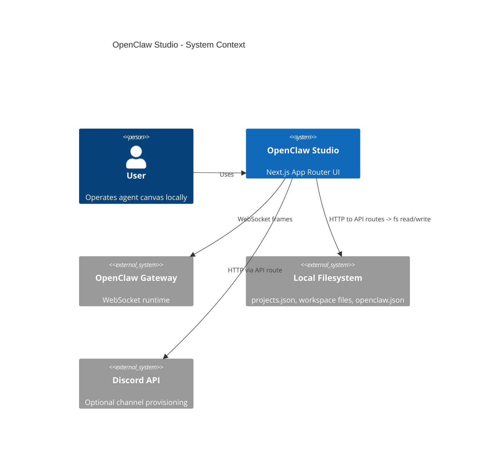
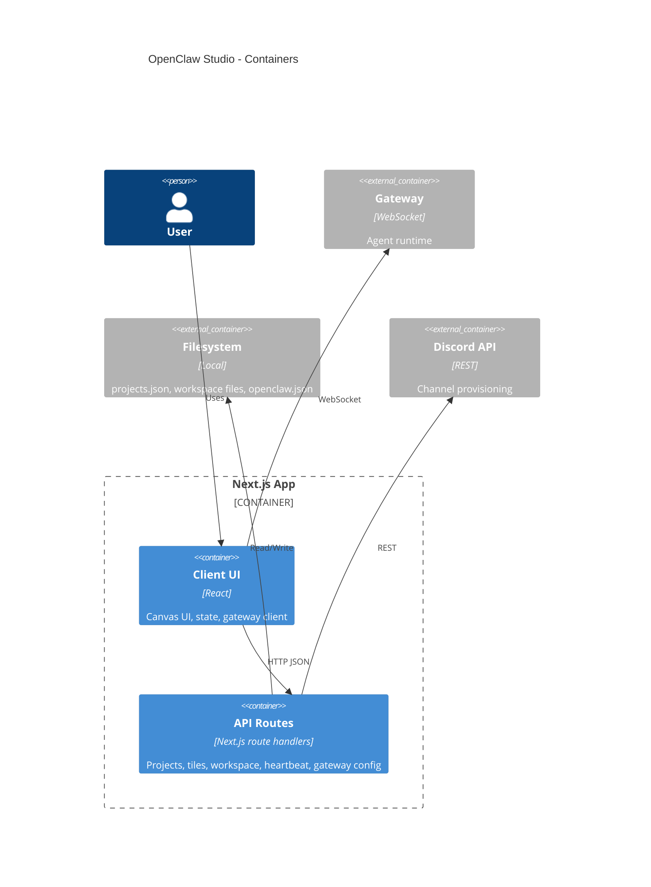

# Architecture

## High-level overview & goals
OpenClaw Studio is a local-first, single-user Next.js App Router UI for managing OpenClaw agents on a canvas. It provides:
- A canvas-based workspace UI for multiple agent tiles.
- Local persistence for projects/tiles via a JSON store on disk.
- Integration with the OpenClaw runtime via a WebSocket gateway.
- Optional Discord channel provisioning for agents.

Primary goals:
- **Local-first**: zero external DB, fast startup, filesystem-backed state.
- **Clear boundaries**: client UI vs server routes vs external gateway/config.
- **Predictable state**: single source of truth for project/tile state.
- **Maintainability**: feature-focused modules, minimal abstractions.

Non-goals:
- Multi-tenant or multi-user concurrency.
- Server-side rendering of data from external services.

## Architectural style
**Layered + vertical slice (feature-first)** within Next.js App Router:
- UI components + feature state in `src/features`.
- Shared utilities and adapters in `src/lib`.
- Server-side route handlers under `src/app/api`.

This keeps feature cohesion high while preserving a clear client/server boundary.

## Main modules / bounded contexts
- **Canvas UI** (`src/features/canvas`): React Flow canvas, tiles, editor UI, local in-memory state + actions. Agent tiles render a status-first summary and latest-update preview driven by gateway events + summary snapshots (`src/features/canvas/state/summary.ts`). Full transcripts load only on explicit “Load history” actions.
- **Projects + workspace settings** (`src/lib/projects`, `src/app/api/projects`, `src/lib/studio`): project/tile models, store persistence, shared store normalization and mutation helpers in `src/app/api/projects/store.ts` (single-workspace normalization + legacy-project capture), workspace settings storage + resolution (`src/lib/studio/workspaceSettings.server.ts`, `src/app/api/workspace/route.ts`), shared project/tile resolution helpers in `src/lib/projects/resolve.server.ts`, sessionKey helpers in `src/lib/projects/sessionKey.ts`, workspace file helpers (`src/lib/projects/workspaceFiles.ts`, `src/lib/projects/workspaceFiles.server.ts`), studio state-dir + worktree helpers in `src/lib/projects/worktrees.server.ts`, cleanup helpers in `src/lib/projects/fs.server.ts` (which delegate to shared server filesystem primitives in `src/lib/fs.server.ts`). Tiles store a shared `workspacePath`, use a single default agent id, and rely on session keys for separation. Archived tiles are hard-deleted via `POST /api/projects/cleanup` after previewing via `GET /api/projects/cleanup`, which removes non-default agent state.
- **Gateway** (`src/lib/gateway`): WebSocket client for agent runtime (frames, connect, request/response). The OpenClaw control UI client is vendored in `src/lib/gateway/openclaw/GatewayBrowserClient.ts` with a sync script at `scripts/sync-openclaw-gateway-client.ts`.
- **OpenClaw config + paths** (`src/lib/clawdbot`): read/write openclaw.json (with legacy fallback), shared agent list helpers (used by heartbeat routes), shared config update helper for routes, heartbeat defaults, consolidated state/config/.env path resolution with `OPENCLAW_*` env overrides (`src/lib/clawdbot/paths.ts`).
- **Discord integration** (`src/lib/discord`, API route): channel provisioning and config binding.
- **Shared utilities** (`src/lib/*`): env, ids, names, avatars, text parsing, logging, filesystem helpers.

## Directory layout (top-level)
- `src/app`: Next.js App Router pages, layouts, global styles, and API routes.
- `src/features`: feature-first UI modules (currently canvas).
- `src/lib`: domain utilities, adapters, API clients, and shared logic.
- `src/components`: shared UI components (minimal use today).
- `src/styles`: shared styling assets.
- `public`: static assets.
- `tests`, `playwright.config.ts`, `vitest.config.ts`: automated testing.

## Data flow & key boundaries
### 1) Project + tile state
- **Source of truth**: JSON store on disk at `~/.openclaw/openclaw-studio/projects.json` with workspace settings in `~/.openclaw/openclaw-studio/settings.json` (legacy fallback to `~/.moltbot` or `~/.clawdbot`). When no workspace is saved, Studio defaults to `~/.clawdbot/workspace` (created if missing). Legacy multi-workspace data is preserved in `~/.openclaw/openclaw-studio/legacy-projects.json` when single-workspace normalization runs.
- **Server boundary**: `src/app/api/projects/*` handles validation, persistence, and side effects.
- **Client boundary**: `AgentCanvasProvider` loads store on startup, caches in memory, and persists via API.

Flow:
1. UI dispatches action.
2. Client calls `lib/projects/client`.
3. API routes mutate store + write files/config; workspace path is configured via `PUT /api/workspace`. Tile creation uses the shared workspace path and provisions workspace files in that directory. Archive operations set `archivedAt` without deleting files.
4. API returns updated store.
5. Client hydrates store into runtime state.

### 2) Agent runtime (gateway)
- **Client-side only**: `GatewayClient` uses WebSocket to connect to the local OpenClaw gateway and wraps the vendored `GatewayBrowserClient`.
- **API is not in the middle**: UI speaks directly to the gateway for streaming and agent events.

Flow:
1. UI loads gateway URL/token from `/api/gateway`.
2. `GatewayClient` connects + sends `connect` request.
3. UI requests `models.list` to populate the model selector (backed by `~/.openclaw/openclaw.json` via the gateway, with legacy fallback).
4. UI sends requests (frames) and receives event streams.
5. Canvas store updates tile output/state.

### 3) Workspace files + heartbeat
- **Workspace files**: `AGENTS.md`, `SOUL.md`, `IDENTITY.md`, `USER.md`, `TOOLS.md`, `HEARTBEAT.md`, `MEMORY.md`.
- **Heartbeat**: stored in `openclaw.json` agent list entries (legacy config supported).

Flow:
1. UI requests workspace files/heartbeat via API.
2. API reads/writes filesystem + config. Workspace files live inside the shared workspace path.
3. UI reflects persisted state.

### 4) Discord provisioning
- API route calls `createDiscordChannelForAgent`.
- Uses DISCORD_BOT_TOKEN from the resolved state-dir `.env` file.
- Updates `openclaw.json` bindings and channel config.

## Cross-cutting concerns
- **Configuration**: `src/lib/env` validates env via zod; `lib/clawdbot/paths.ts` resolves config path and state dirs, honoring `OPENCLAW_STATE_DIR`/`OPENCLAW_CONFIG_PATH` and legacy fallbacks.
- **Logging**: `src/lib/logger` (console wrappers) used in API routes and gateway client.
- **Error handling**:
  - API routes return JSON `{ error }` with appropriate status.
  - `fetchJson` throws when `!res.ok`, surfaces errors to UI state.
- **Filesystem helpers**: server-only filesystem utilities live in `src/lib/fs.server.ts` (safe directory/file creation, idempotent deletes, git repo initialization for new workspaces, and home-scoped path autocomplete). Feature-specific server modules build on top of these: `src/lib/projects/workspaceFiles.server.ts` provisions and reads/writes workspace files; `src/lib/projects/fs.server.ts` handles cleanup operations. State/config path expansion lives in `src/lib/clawdbot/paths.ts`.
- **Projects store normalization**: `src/app/api/projects/store.ts` keeps active project selection consistent, enforces a single workspace, and backfills `workspacePath` + `archivedAt`.
- **Tracing**: `src/instrumentation.ts` registers `@vercel/otel` for telemetry.
- **Validation**: request payload validation in API routes; shared project/tile resolution in `src/lib/projects/resolve.server.ts`; typed payloads in `lib/projects/types`.

## Major design decisions & trade-offs
- **Local JSON store over DB**: faster iteration, local-first; trade-off is no concurrency or multi-user support.
- **WebSocket gateway direct to client**: lowest latency for streaming; trade-off is tighter coupling to the gateway protocol in the UI.
- **Vendored gateway client + sync script**: reduces drift from upstream OpenClaw UI; trade-off is maintaining a sync path and local copies of upstream helpers.
- **Feature-first organization**: increases cohesion in UI; trade-off is more discipline to keep shared logic in `lib`.
- **Node runtime for API routes**: required for filesystem access; trade-off is Node-only server runtime.
- **Single workspace + session-only tiles**: all tiles share one workspace path while sessions remain isolated via session keys; trade-off is less filesystem isolation between tiles.
- **Event-driven summaries + on-demand history**: keeps the dashboard lightweight; trade-off is history not being available until requested.
- **Archive-first deletes**: preserves local state by default; trade-off is explicit cleanup as a separate operation, handled by `GET/POST /api/projects/cleanup`.

## Mermaid diagrams
### C4 Level 1 (System Context)

### C4 Level 2 (Containers/Components)

## Explicit forbidden patterns
- Do not read/write local files directly from client components.
- Do not bypass `lib/projects/client` for API calls from UI.
- Do not introduce a new persistence layer without a clear migration path from `projects.json`.
- Do not store gateway tokens or secrets in client-side persistent storage.
- Do not add new global mutable state outside `AgentCanvasProvider` for canvas data.
- Do not silently swallow errors in API routes; always return actionable errors.
- Do not add heavy abstractions or frameworks unless there is clear evidence of need.

## Future-proofing notes
- If multi-user support becomes a goal, replace the JSON store with a DB-backed service and introduce authentication at the API boundary.
- If gateway protocol evolves, isolate changes within `src/lib/gateway` and keep UI call sites stable.
